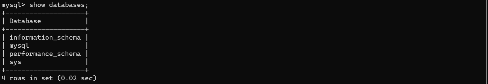
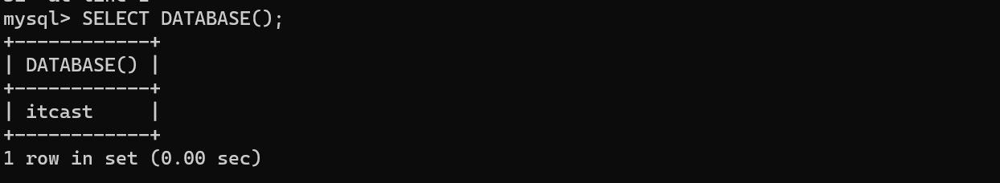
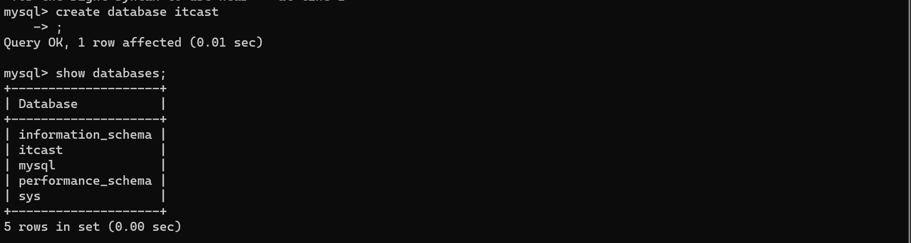
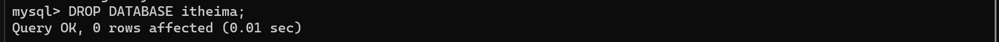
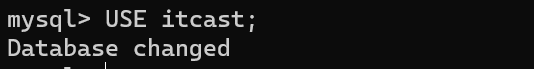
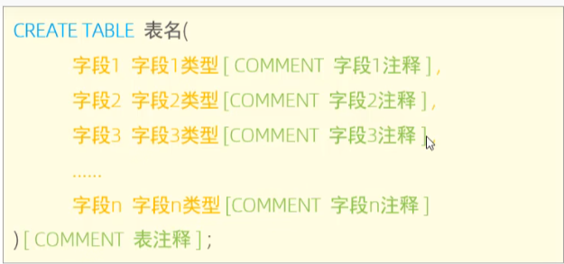
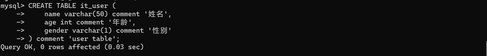
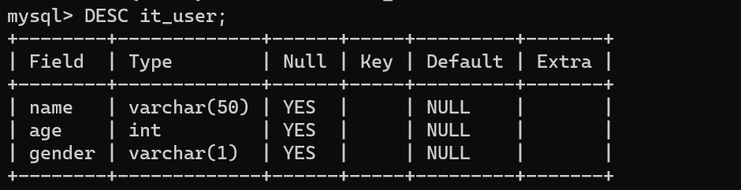
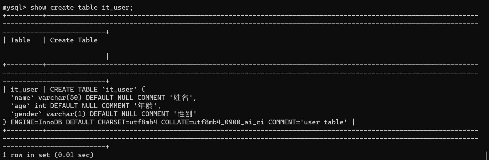

# DDL
## 数据库操作
#### 查询
1. 查询所有数据库   
>**SHOW DATABASES;**

1. 查询当前数据库
>**SELECT DATABASE();**
>
* 创建
> **CREATE DATABASE [IF NOT EXISTS]数据库的名称 [DEFAULT CHARSET字符集][COLLATE排序规则]；**
> 
> 
* 删除
>**DROP DATABASE [IF EXIST]名称;**

* 使用数据库
> **USE DATABASE 名称；**
> 

## 表操作
#### 创建
  > 
  > ---
  >
  >注意：
  >1. 最好全程用英文输入法打，好累啊打中英文切换
  >2. 字符类型是varchar()后面要加上大小
  >3. 最后一个字段后面不用加逗号，其他都要加，跟golang的结构体设定差不多
  >4. 注释要用单引号或者双引号来引导
  > ----
  
* 查询
> 1. 查询所有的表结构（前提是已经进入到某个数据库）
> **SHOW TABLES;**
> 2. 查询表结构（但是只是结构，具体数值不展示）
> **DESC 名称；**
> 
> 3. 查询指定表的建表语句（详细结构信息）
> **SHOW CREATE TABLE IT_USER;**
> 
