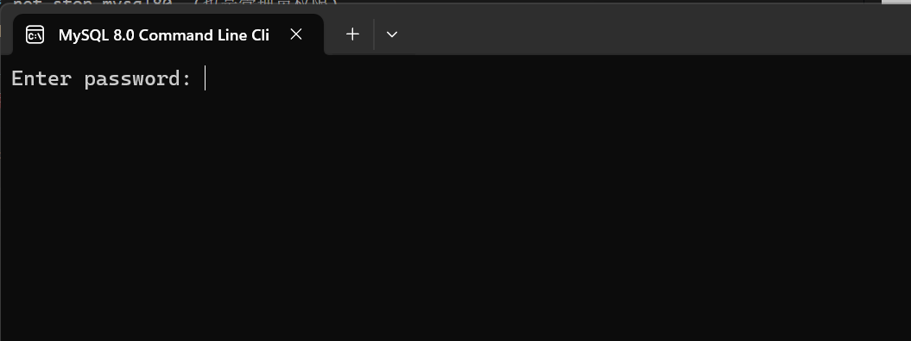
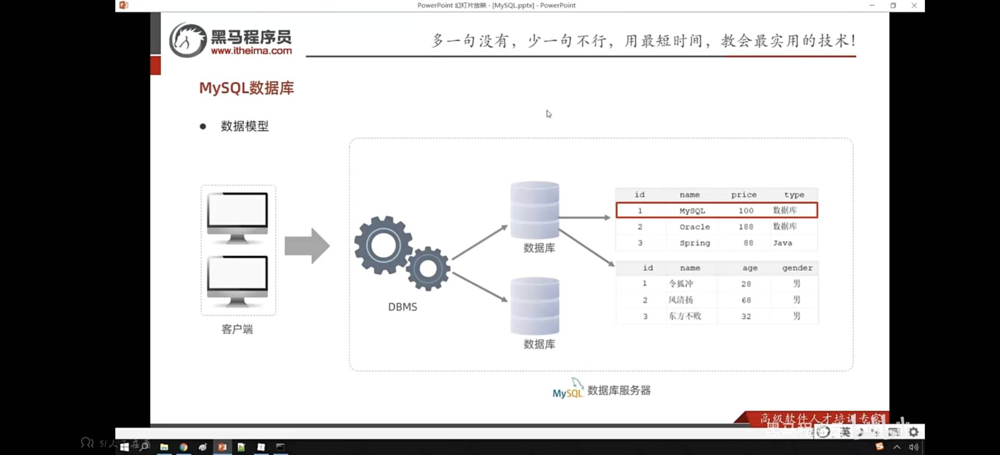

# Mysql 概述
- ***数据库***  储存数据的仓库，数据是有组织进行存储  简称Database(DB)
-  ***数据库管理系统***  是操纵和管理数据库的大型**软件** DataBaseManagement System(DBMS)
-  ***SQL***  操作关系型数据库的编程语言  Structured Query Language(SQL)  
> 一般而言我们是通过SQL语法来操作DBMS来增删改查数据库   

## 主流的关系型数据库管理系统
- Oracle
- MySQL
- SQL server
- PostgreSQL...    
> 关系型数据库的操作都是通过SQL所以无论是那款数据库,都能够很好衔接   
---
---

### 启动和停止
* **启动** net start mysql80 (用管理员权限启动,不区分大小写)
* **停止** net stop mysql80  (也是管理员权限)  
* 默认mysql开机自动启动
>Win+R:

---

### 客户端连接
1. 直接使用Mysql提供的客户端命令行工具
**客户端工具：**

**界面：**
 
密码123456
2. 使用windows的命令行工具执行指令
> mysql[-h 127.0.0.1][-p 3306] -u root -p 
* [ ]中可以省略，默认表示本地host post user password
* 还要配置环境,就是把bin的路径添加到path下面

### mysql数据模型
 数据库+表
* 关系型数据库： 建立在关系模型基础上，由多张互相连接的二维表组成的数据库

